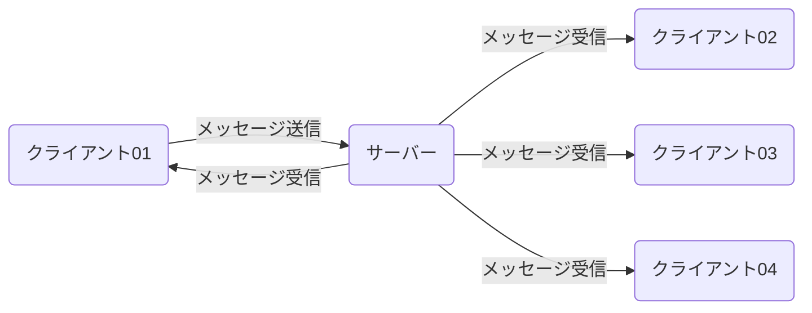

## 環境構築
- node.jsのインストール
- 本リポジトリをクローン
- クローンしたフォルダは以下にて、`npm install`(必要なライブラリ等を`package.json`からインストール)を実施

## ローカルサーバー起動
- クローンしたフォルダ配下にて、`node sever.js`を実行
- `http://localhost:8080/`に接続すると起動を確認可能

## socket.ioの双方向リアルタイム通信のイメージ図
`クライアント01`がメッセージを送信し、サーバーがそのメッセージを検知し、全クライアントに送信するイメージ図

